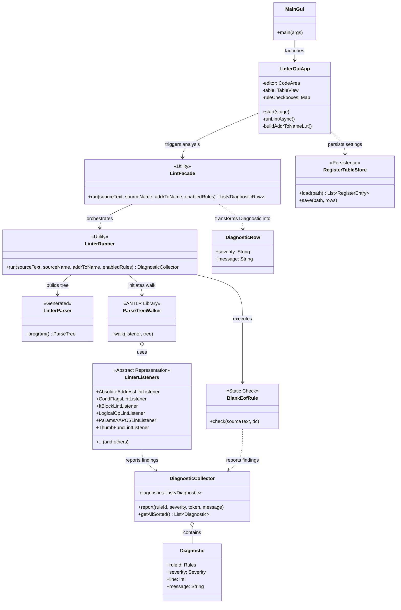

```mermaid
classDiagram
%% Entry Point
class MainGui {
+main(args)
}

    %% UI Layer
    class LinterGuiApp {
        -editor: CodeArea
        -table: TableView
        -ruleCheckboxes: Map
        +start(stage)
        -runLintAsync()
        -buildAddrToNameLut()
    }

    %% Logic Facade
    class LintFacade {
        <<Utility>>
        +run(sourceText, sourceName, addrToName, enabledRules) List~DiagnosticRow~
    }

    %% Core Engine
    class LinterRunner {
        <<Utility>>
        +run(sourceText, sourceName, addrToName, enabledRules) DiagnosticCollector
    }

    %% ANTLR Generated
    class LinterParser {
        <<Generated>>
        +program() ParseTree
    }
    
    class ParseTreeWalker {
        <<ANTLR Library>>
        +walk(listener, tree)
    }

    %% Rules & Listeners
    class LinterListeners {
        <<Abstract Representation>>
        +AbsoluteAddressLintListener
        +CondFlagsLintListener
        +ItBlockLintListener
        +LogicalOpLintListener
        +ParamsAAPCSLintListener
        +ThumbFuncLintListener
        +... (and others)
    }

    class BlankEofRule {
        <<Static Check>>
        +check(sourceText, dc)
    }

    %% Data Management
    class DiagnosticCollector {
        -diagnostics: List~Diagnostic~
        +report(ruleId, severity, token, message)
        +getAllSorted() List~Diagnostic~
    }

    class RegisterTableStore {
        <<Persistence>>
        +load(path) List~RegisterEntry~
        +save(path, rows)
    }

    %% Models
    class Diagnostic {
        +ruleId: Rules
        +severity: Severity
        +line: int
        +message: String
    }

    class DiagnosticRow {
        +severity: String
        +message: String
    }

    %% Relationships
    MainGui --> LinterGuiApp : launches
    LinterGuiApp --> LintFacade : triggers analysis
    LinterGuiApp --> RegisterTableStore : persists settings
    
    LintFacade --> LinterRunner : orchestrates
    LinterRunner --> LinterParser : builds tree
    LinterRunner --> BlankEofRule : executes
    LinterRunner --> ParseTreeWalker : initiates walk
    
    ParseTreeWalker o-- LinterListeners : uses
    LinterListeners ..> DiagnosticCollector : reports findings
    BlankEofRule ..> DiagnosticCollector : reports findings
    
    DiagnosticCollector o-- Diagnostic : contains
    LintFacade ..> DiagnosticRow : transforms Diagnostic into
```