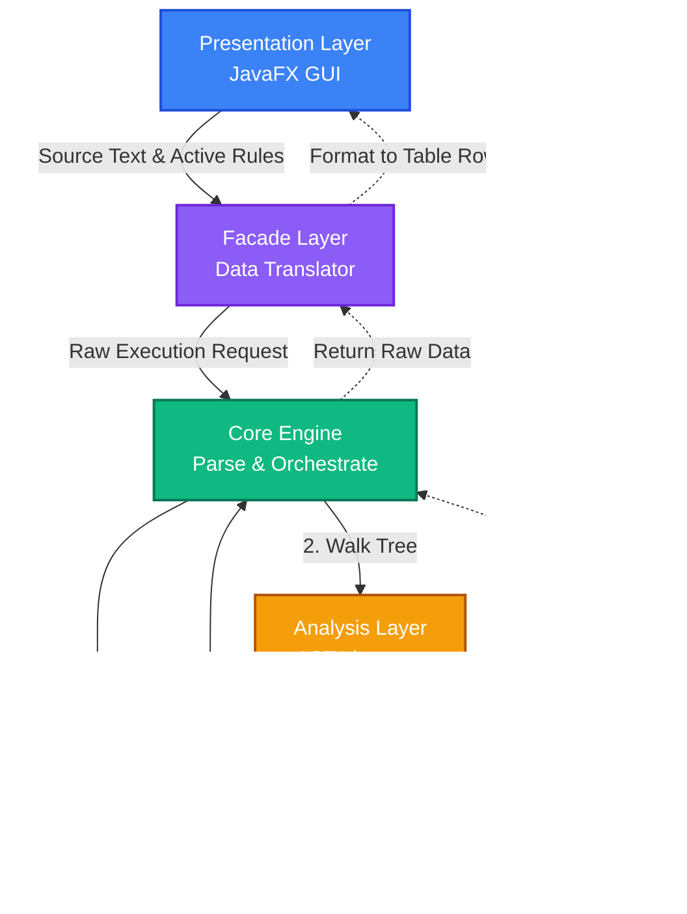

```mermaid
flowchart TD
%% Define styles
    classDef ui fill:#3b82f6,stroke:#1d4ed8,stroke-width:2px,color:#fff;
    classDef facade fill:#8b5cf6,stroke:#6d28d9,stroke-width:2px,color:#fff;
    classDef engine fill:#10b981,stroke:#047857,stroke-width:2px,color:#fff;
    classDef logic fill:#f59e0b,stroke:#b45309,stroke-width:2px,color:#fff;
    classDef data fill:#ef4444,stroke:#b91c1c,stroke-width:2px,color:#fff;

%% Nodes
    UI["Presentation Layer<br>JavaFX GUI"]:::ui
    Facade["Facade Layer<br>Data Translator"]:::facade
    Engine["Core Engine<br>Parse & Orchestrate"]:::engine
    Rules["Analysis Layer<br>AST Listeners"]:::logic
    Collector["Data Layer<br>Diagnostic Collector"]:::data

%% Edges
    UI -->|Source Text & Active Rules| Facade
    Facade -->|Raw Execution Request| Engine
    Engine -->|1. Build Parse Tree| Engine
    Engine -->|2. Walk Tree| Rules
    Rules -->|3. Report Warnings/Errors| Collector
    Collector -.->|Sorted Raw Data| Engine
    Engine -.->|Return Raw Data| Facade
    Facade -.->|Format to Table Rows| UI
```